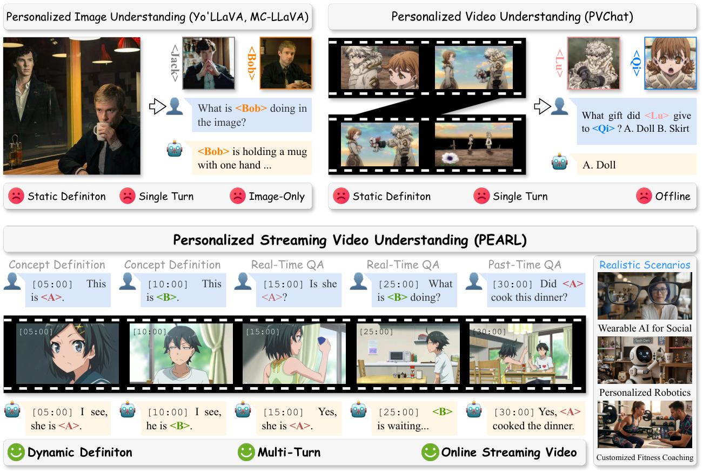
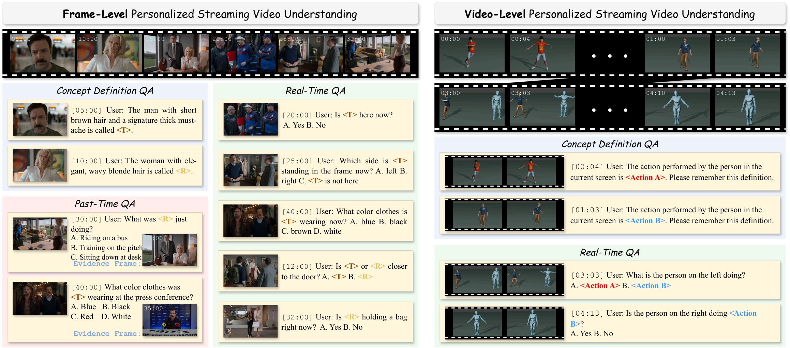
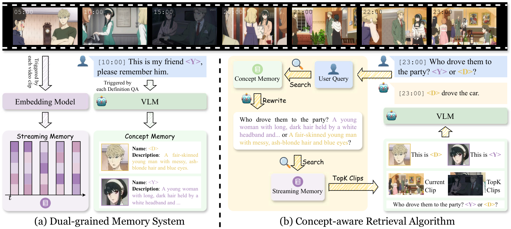

<p align="center">
  
</p>

<p align="center">
  <a href="https://arxiv.org/abs/2507.09446" style="margin-right: 10px;">
    
  </a>
  <a href="https://huggingface.co/datasets/zyh200727/PEARL-Data" style="margin-right: 10px;">
    
  </a>
  <a href="https://www.modelscope.cn/datasets/YuanhongZheng/PEARL-Data" style="margin-right: 10px;">
    
  </a>
</p>

<h1 align="center">Personalized Streaming Video Understanding Model</h1>

<p align="center">
  <a href="">Yuanhong Zheng</a><sup>1,*</sup>, <a href="">Ruichuan An</a><sup>1,*</sup>, <a href="">Xiaopeng Lin</a><sup>1</sup>, <a href="">Yuxing Liu</a><sup>1</sup>, <a href="">Sihan Yang</a><sup>1</sup>, <a href="">Huanyu Zhang</a><sup>3</sup>, <a href="">Haodong Li</a><sup>4</sup>, <a href="">Qintong Zhang</a><sup>1</sup>, <a href="">Renrui Zhang</a><sup>5</sup>, <a href="">Guopeng Li</a><sup>4</sup>, <a href="">YiFan Zhang</a><sup>3,&dagger;</sup>, <a href="">Yuheng Li</a><sup>2,&#9993;</sup>, <a href="">Wentao Zhang</a><sup>1,6,&#9993;</sup>
</p>

<p align="center">
  <sup>1</sup>Peking University &nbsp; <sup>2</sup>Adobe &nbsp; <sup>3</sup>CASIA &nbsp; <sup>4</sup>Stepfun &nbsp; <sup>5</sup>CUHK &nbsp; <sup>6</sup>Zhongguancun Academy
</p>

<p align="center">
  <sup>*</sup>Equal contribution &nbsp; <sup>&dagger;</sup>Project leader &nbsp; <sup>&#9993;</sup>Corresponding authors
</p>

> PEARL studies Personalized Streaming Video Understanding (PSVU), a new setting where models must recognize user-defined concepts, localize them at precise timestamps, and answer personalized queries over continuous video streams. To support this task, we introduce PEARL-Bench, the first benchmark for personalized streaming video understanding, and PEARL, a plug-and-play framework with dual-grained memory and concept-aware retrieval algorithm that improves off-the-shelf VLMs without parameter updates.

<p align="center">
  
</p>
<p align="center">
  <em>Task overview: PEARL focuses on personalized streaming video understanding with continuous video, dynamic concepts, and multi-turn interactions.</em>
</p>

## 🛠️ Install

### 1. Create a Python environment

We recommend Python 3.11:

```bash
conda create -n pearl python=3.11 -y
conda activate pearl
```

### 2. Install dependencies

Install the Python dependencies first:

```bash
pip install -r requirements.txt
```

Install `ffmpeg` with conda:

```bash
conda install -c conda-forge ffmpeg
```

Install the local third-party packages without pulling extra dependencies:

```bash
pip install -e third_party/qwen-vl-utils --no-deps
pip install -e third_party/Qwen3-VL-Embedding --no-deps
```

## 📦 Dataset

<p align="center">
  
</p>
<p align="center">
  <em>PEARL-Bench overview: frame-level and video-level settings.</em>
</p>

Download the archive from one of the following mirrors:

- [Hugging Face](https://huggingface.co/datasets/zyh200727/PEARL-Data)
- [ModelScope](https://www.modelscope.cn/datasets/YuanhongZheng/PEARL-Data)

After downloading, place the split archives under the project root, merge them, and then extract:

```bash
cat frame-level.tar.gz.part* > frame-level.tar.gz
tar -xzf frame-level.tar.gz
```

After extraction, the dataset should be available under `data/frame-level/`.

The extracted directory structure should include:

```text
data/
  frame-level/
    annotations/
    output_clips/
    videos/
```

## 🤖 Models

Please download the following models and place them under `models/`:

- [`Qwen3-VL-8B-Instruct`](https://huggingface.co/Qwen/Qwen3-VL-8B-Instruct)
- [`Qwen3-VL-Embedding-2B`](https://huggingface.co/Qwen/Qwen3-VL-Embedding-2B)
- [`llava-onevision-qwen2-7b-ov-hf`](https://huggingface.co/llava-hf/llava-onevision-qwen2-7b-ov-hf) (optional)

## 📊 Evaluation

<p align="center">
  
</p>
<p align="center">
  <em>PEARL framework: concept memory, streaming memory, and concept-aware retrieval for personalized response generation.</em>
</p>

The evaluation pipeline has four stages:

1. Split each source video into scene clips.
2. Start the VLM server and the embedding server on each GPU.
3. Run multi-GPU inference over the annotation files.
4. Aggregate the final evaluation metrics.

### 1. Split Videos Into Scene Clips

Run the scene splitting script first:

```bash
bash scripts/split_scene.sh
```

This script scans `data/frame-level/videos/` for `.mp4` files and invokes `video_scene_splitter.py` to generate scene clips and clip metadata for each video.

For evaluation, the inference script expects:

- annotations under `data/frame-level/annotations/`
- scene clips under `data/frame-level/output_clips/`

> For evaluation, make sure both directories are prepared before starting inference.

### 2. Start The Model Servers

Launch the VLM server and the embedding server on all GPUs before inference:

```bash
bash scripts/start_multi_gpu_servers.sh 8
```

Replace `8` with the number of GPUs you want to use.

By default, the launcher uses:

- `models/Qwen3-VL-8B-Instruct` for `server/qwenvl_flask_server.py`
- `models/llava-onevision-qwen2-7b-ov-hf` for `server/llava_ov_flask_server.py`

### 3. Run Inference

After all servers are ready, run:

```bash
bash scripts/eval_qwen.sh 8
```

For each annotation file, the script produces:

- `*_result.json`: model predictions
- `*_evaluation.json`: per-file evaluation summary

### 4. Aggregate Final Metrics

Once inference is finished, compute the overall metrics with:

```bash
python eval.py <output_dir>
```

This command reads all `*_evaluation.json` files in the result directory and reports:

- avg accuracy
- current-time QA accuracy
- past-time QA accuracy

## ✅ TODO

- [ ] Video-Level Data and Evaluation
- [ ] Live Streaming Demo

## 📜 License

The dataset and code are released under [CC-BY 4.0](https://creativecommons.org/licenses/by/4.0/). Please provide appropriate attribution when using or redistributing this project.

## 📬 Contact

For any questions or feedback, please open an issue or reach out to us at zyh2022200727@gmail.com.
